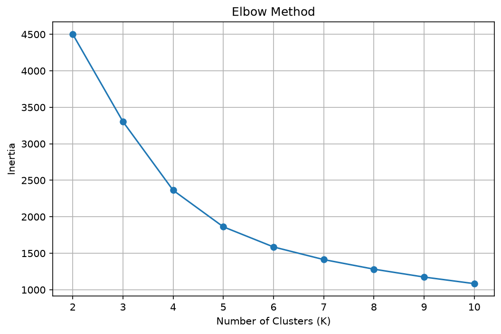
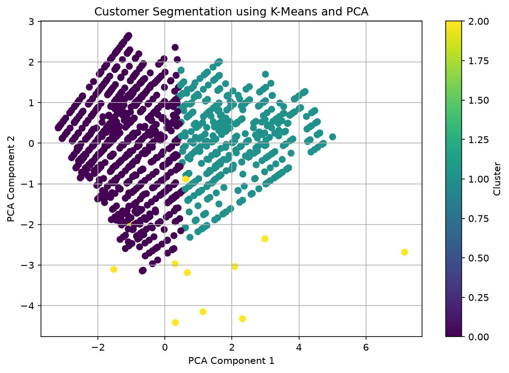
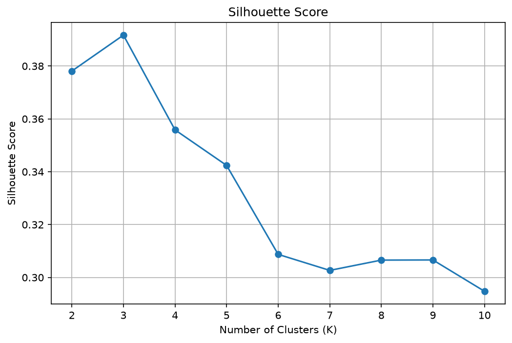

# 📊 Customer Segmentation Using Machine Learning

## 📌 Project Overview

Customer Segmentation is a Machine Learning project that uses K-Means Clustering to group customers into different segments based on their characteristics and behavior.

## 🎯 Objectives

- Analyze customer data.
- Preprocess data using StandardScaler.
- Apply K-Means Clustering.
- Find the optimal number of clusters using the Elbow Method.
- Evaluate clustering using Silhouette Score.
- Visualize customer clusters using PCA.

## 🛠️ Technologies Used

- Python
- Pandas
- Matplotlib
- Scikit-learn
- Excel

## 📂 Project Files

- `customer_segmentation.py` — Main Python program
- `Dataset for Data Analysis.xlsx` — Customer dataset
- `elbow_method.png` — Elbow Method visualization
- `customer_clusters.png` — Customer cluster visualization
- `silhouette_scores.png` — Silhouette Score visualization

## 🔄 Project Workflow

1. Load the customer dataset using Pandas.
2. Preprocess and scale numerical features using StandardScaler.
3. Use the Elbow Method to select a suitable number of clusters.
4. Apply K-Means Clustering.
5. Evaluate the clustering using Silhouette Score.
6. Use PCA to visualize customer clusters.

## 📈 Visualizations

### Elbow Method



### Customer Clusters



### Silhouette Scores



## 🚀 How to Run the Project

### Install Required Libraries

```bash
pip install pandas matplotlib scikit-learn openpyxl
```

### Run the Python File

```bash
python customer_segmentation.py
```

## 📊 Results

The project generates visualizations to analyze customer clusters and evaluate the clustering model using the Elbow Method and Silhouette Score.

## 🔮 Future Improvements

- Add interactive dashboards.
- Explore additional clustering algorithms.
- Improve data preprocessing.
- Add more customer behavior analysis

This project is created for educational and learning purposes.
  
